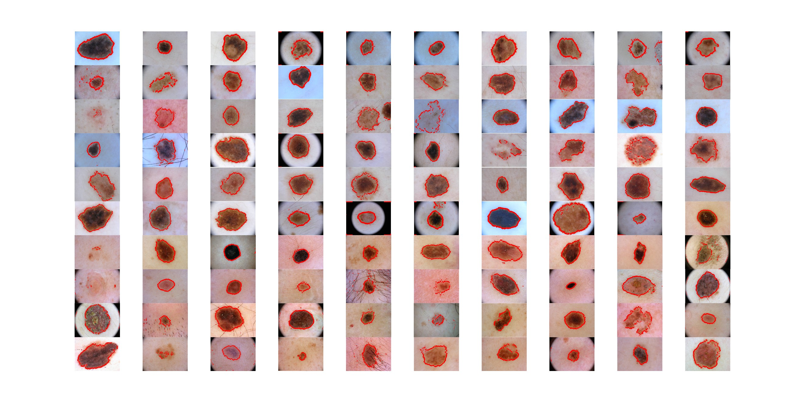

## Bisection Based Skin Lesion Boundaries Detection
The project was created for the Numerical Methods course at my University.  
**The Objective**: Create an algorithm in the MATLAB environment that uses the bisection method to find the root of any function within a given interval [a, b]. Then, apply this algorithm to a practical problem of identifying boundary points of skin changes, such as melanoma.  

The edge detection process consists of a few parts:
* Pre-processing - stretching the histogram
* Dividing the image into two horizontal windows and two vertical windows to enable edge detection using the bisection method
* Moving a vector (window) of one dimension length across the entire image and using the bisection method to find edges (the process is repeated for each window)  
  
The dataset was extensive (around 3500 images) and consisted of two parts - nevus and melanoma. Analysis of several images was challenging due to numerous artifacts, such as vignetting effects. However, this was mitigated by dynamically reducing the window size in areas where vignetting might have occurred. Sample results are depicted below.

### Technologies
* Matlab

### Features
* Pre-process images with histogram stretching
* Detect edges of skin lesion using bisection method
* Present the results

### Setup and usage
After downloading the repository one should simply run it in Matlab. It is possible to play with the hyperparameters

### Sample Results
